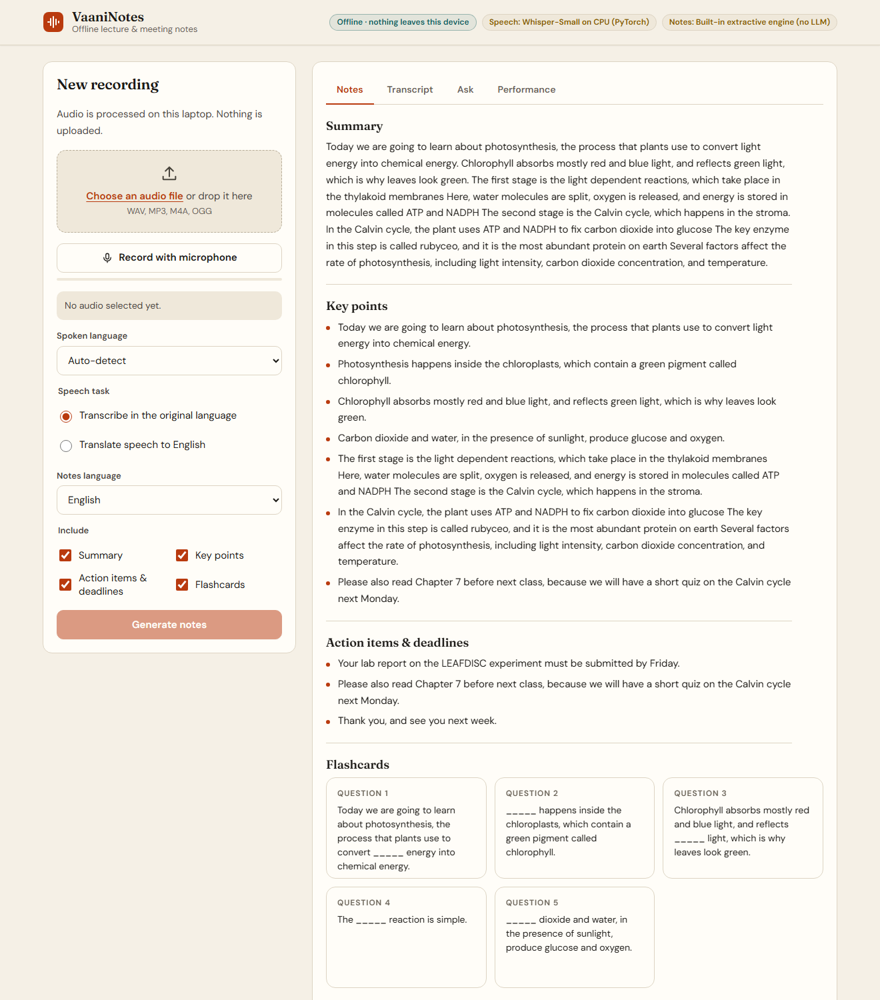
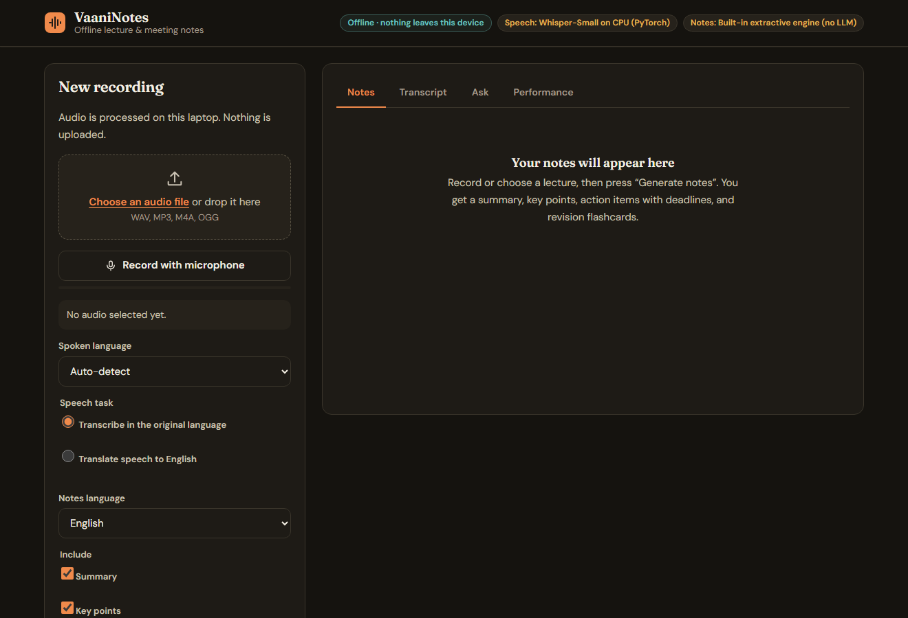
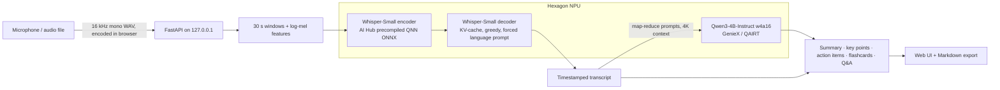

# VaaniNotes

**Offline, multilingual lecture & meeting notes that run on the Snapdragon NPU.**
Record or drop in audio in Hindi, English or nine other Indian languages and get a transcript, a summary, key points, action items with deadlines, and revision flashcards. Nothing ever leaves the laptop.

*Vaani (वाणी) = speech.* Built for the **Snapdragon® AI Lab Build & Present Challenge** (Qualcomm × HP).



## Why

Students and professionals in India sit through hours of lectures and meetings in a mix of languages, often with patchy internet, and cloud transcription means uploading private classroom, clinic or office audio to someone else's server. A Snapdragon X laptop has an NPU that can do this work locally: faster than real time, on battery, in airplane mode.

## What it does

| | |
|---|---|
| **Speech → text in 11 languages** | Whisper-Small from Qualcomm AI Hub on the Hexagon NPU. Auto-detects the language, or translates speech straight to English. |
| **Notes, not just a transcript** | Summary, key points, action items & deadlines, and flip-card flashcards, written by a local LLM (Qwen3-4B-Instruct on the NPU via Qualcomm GenieX). Notes can be written in any of 11 languages. |
| **Ask the recording** | "When is the lab report due?" → answer with a `[mm:ss]` timestamp, retrieved from the transcript. |
| **Private by construction** | Server binds to `127.0.0.1`; the UI ships a strict Content-Security-Policy (`default-src 'self'`), so the page *cannot* call out. No telemetry, no accounts, no CDN. |
| **Always works** | No NPU? It falls back to CPU. No LLM running? A built-in extractive engine still produces notes. |
| **Accessible** | Keyboard-only operation, screen-reader landmarks and live regions, WCAG AA contrast, 44 px targets, light/dark, reduced-motion, correct `lang` tags for Indic scripts. |

Light and dark themes follow the system setting:



## How it uses Snapdragon



- **Speech:** `whisper_small` (float, *Precompiled QAIRT ONNX*) downloaded from **Qualcomm AI Hub** for the exact chipset (X Elite / X Plus / X2 Elite). It runs through **ONNX Runtime's QNN execution provider** on the HTP backend in burst mode. The decoder loop ([`vaani/asr.py`](vaani/asr.py)) is written in numpy against the AI Hub I/O contract (cross-attention KV cache from the encoder, self-attention KV cache carried between steps), so the NPU path needs no PyTorch.
- **Notes LLM:** `Qwen3-4B-Instruct-2507` (w4a16) served by **Qualcomm GenieX** on the NPU through its local OpenAI-compatible endpoint (`127.0.0.1:18181`). Long recordings are condensed map-reduce style to stay inside the 4K context.
- **Device-aware setup:** `setup.ps1` detects the chipset and fetches the matching precompiled model; the UI shows where each model is actually running.

## Performance

**Published by Qualcomm AI Hub** for the exact models VaaniNotes uses (hosted reference devices, NPU). Full table and how to reproduce: [`benchmarks/aihub_published.md`](benchmarks/aihub_published.md).

| Model | Snapdragon X Elite | Snapdragon X2 Elite |
|---|---|---|
| Whisper-Small encoder (per 30 s of audio) | 117 ms | 53 ms |
| Whisper-Small decoder (per token) | 10.5 ms | 6.3 ms |
| Qwen3-4B-Instruct, GenieX QAIRT w4a16 | 22.6 tokens/s | — |

That works out to roughly **1 s of NPU time per 30 s of speech**, about 30× faster than real time, so a one-hour lecture transcribes in around two minutes.

**Measured on your own laptop:** run the benchmark below; it writes `benchmarks/local_results.md` with NPU vs CPU timings for the same audio and shows live timings in the app's *Performance* tab.

```powershell
.venv\Scripts\python scripts\benchmark.py samples\lecture_demo.wav
```

For reference, the CPU fallback (PyTorch) on a 13th-gen Intel i5 laptop transcribes the 93 s sample in about 45–56 s (1.7–2.1× real time).

## Quick start

Requirements: Windows 11, Python 3.11–3.13 (native **ARM64** Python on Snapdragon), ~2 GB disk.

```powershell
git clone <this repo> ; cd vaaninotes
powershell -ExecutionPolicy Bypass -File setup.ps1     # installs deps, downloads the AI Hub model for your chip
.\run.ps1                                              # opens http://127.0.0.1:7860
```

For NPU-written notes, install [Qualcomm GenieX](https://geniex.aihub.qualcomm.com) and start its local server before launching the app:

```powershell
geniex serve      # OpenAI-compatible API on http://127.0.0.1:18181 (model: ai-hub-models/Qwen3-4B-Instruct-2507)
```

VaaniNotes finds it automatically. Ollama (`:11434`) and LM Studio (`:1234`) are detected as CPU/GPU alternatives; with none running, the extractive engine is used.

Command line:

```powershell
.venv\Scripts\python -m vaani.cli lecture.wav --lang hi --notes-lang Hindi --ask "What is the homework?"
```

### Configuration (environment variables)

| Variable | Default | Meaning |
|---|---|---|
| `VAANI_ASR` | `auto` | `auto`, `npu`, or `cpu` |
| `VAANI_WHISPER_NPU_DIR` | `models/whisper_small` | Folder with the AI Hub encoder/decoder |
| `VAANI_LLM` | `auto` | `auto`, `geniex`, `ollama`, `lmstudio`, `extractive` |
| `VAANI_LLM_URL` / `VAANI_LLM_MODEL` | — / `ai-hub-models/Qwen3-4B-Instruct-2507` | Any local OpenAI-compatible server |

## Project layout

```
vaani/
  asr.py        Whisper on the NPU (QNN) and CPU fallback; 30 s windowing, language prompts
  qnn.py        ONNX Runtime QNN session setup (plugin EP 2.x and legacy 1.x)
  llm.py        Local LLM client (GenieX / OpenAI-compatible) + extractive fallback
  pipeline.py   Transcript → notes (map-reduce), flashcards, question answering
  server.py     FastAPI app: job queue, progress, CSP, downloads
  web/          Frontend (semantic HTML, CSS tokens from DESIGN.md, vanilla JS, self-hosted fonts)
  cli.py        Command-line interface
scripts/benchmark.py   NPU vs CPU benchmark
benchmarks/            Published AI Hub numbers + your local results
tests/                 Unit tests (pytest)
DESIGN.md              Design system the UI is built from
```

## Testing

```powershell
.venv\Scripts\python -m pytest -q
```

Verified so far: 20 automated tests (the decoder against the AI Hub I/O contract, the notes pipeline, and the web API); the full pipeline, web API and UI on the CPU path (x86 Windows 11). The NPU path is implemented against Qualcomm's published model contract and must be confirmed on a Snapdragon device with `scripts/benchmark.py`.

## Limitations & roadmap

- Whisper-Small trades some accuracy on Indian languages for speed; `whisper_large_v3_turbo` from AI Hub is a drop-in upgrade (`VAANI_WHISPER_HF_ID`, `VAANI_WHISPER_NPU_DIR`).
- No speaker diarisation yet.
- Live (streaming) captions while recording are next; the 30 s window design already supports it.

## Credits & licences

- Models: [Whisper-Small](https://aihub.qualcomm.com/models/whisper_small) (OpenAI, Apache-2.0 export by Qualcomm AI Hub); [Qwen3-4B-Instruct-2507](https://aihub.qualcomm.com/models/qwen3_4b_instruct_2507) (Alibaba, Apache-2.0).
- The NPU decoding loop follows the I/O contract of `HfWhisperApp` in [qai-hub-models](https://github.com/quic/ai-hub-models) (BSD-3-Clause).
- Fonts: Fraunces, DM Sans, JetBrains Mono (SIL Open Font License), self-hosted.
- Code: MIT (see [LICENSE](LICENSE)). Snapdragon and Qualcomm are trademarks of Qualcomm Incorporated; this is an independent challenge entry.
